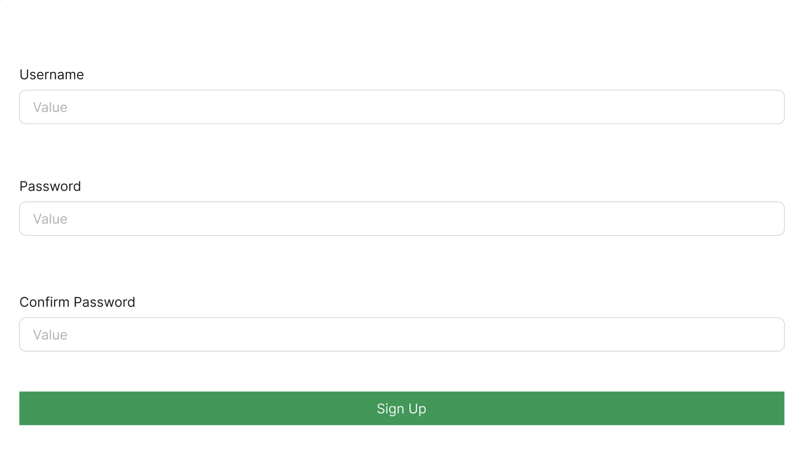
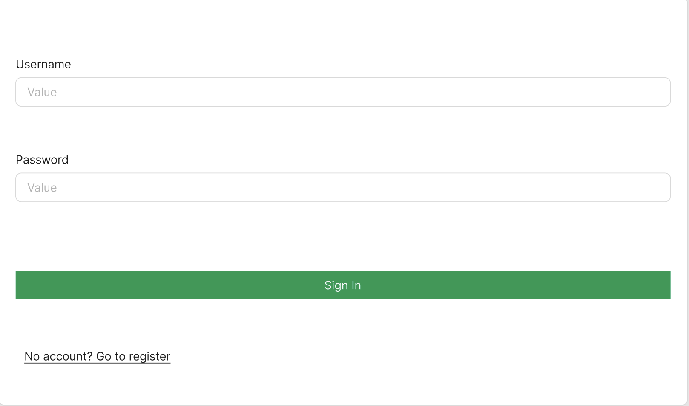
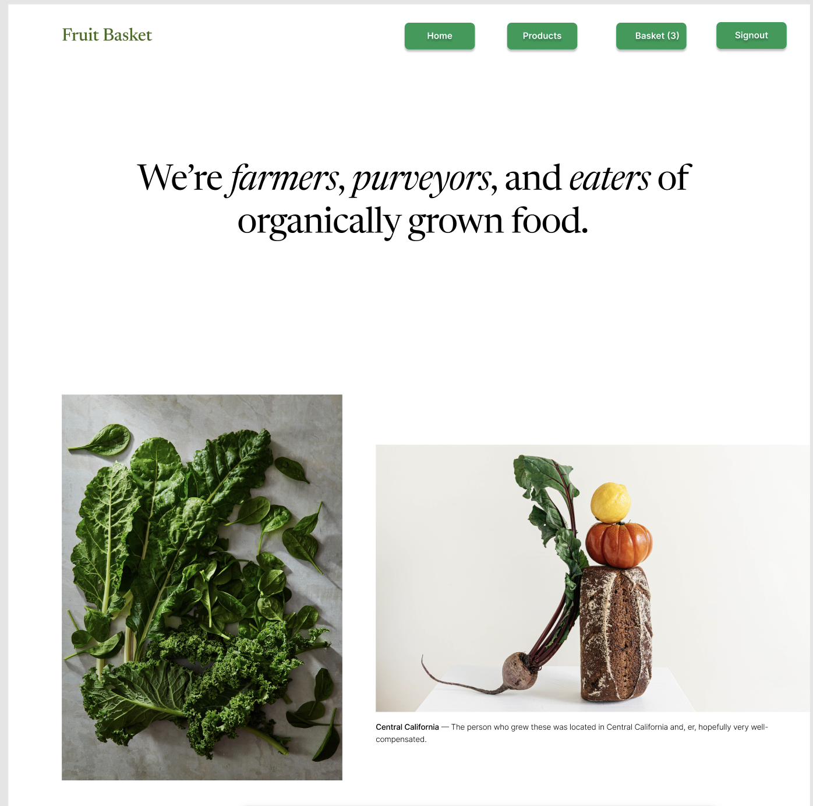
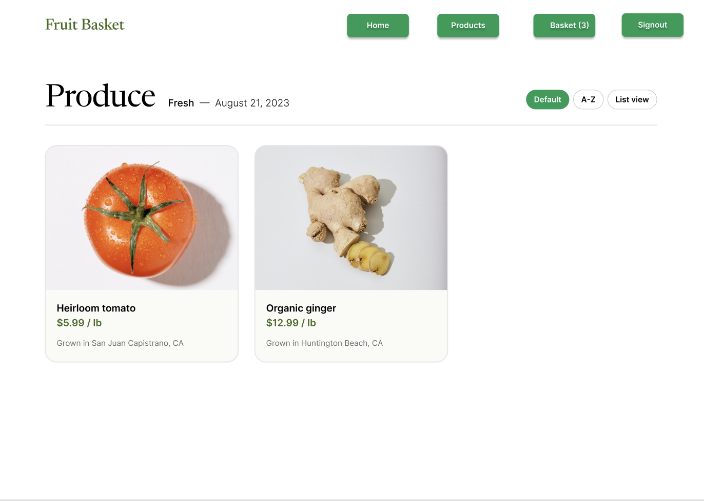
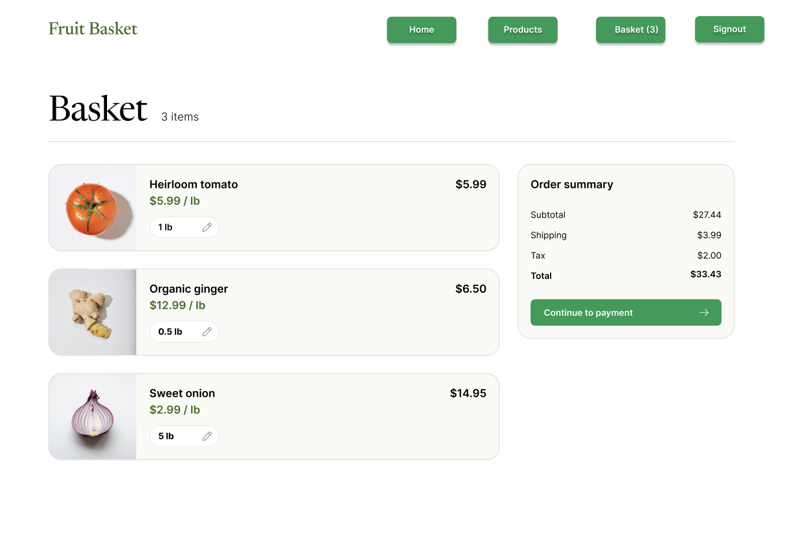
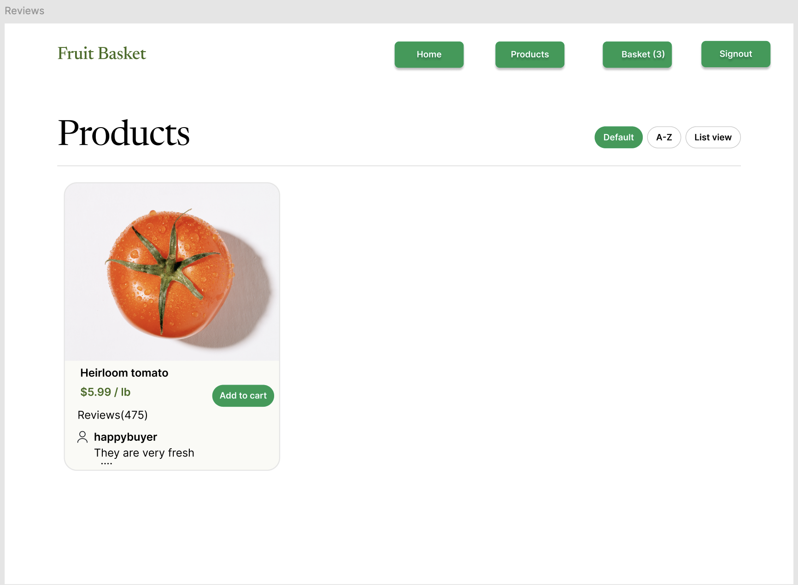
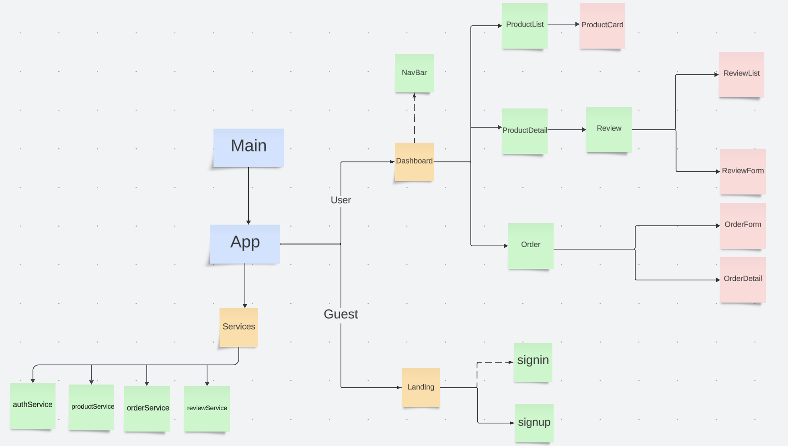
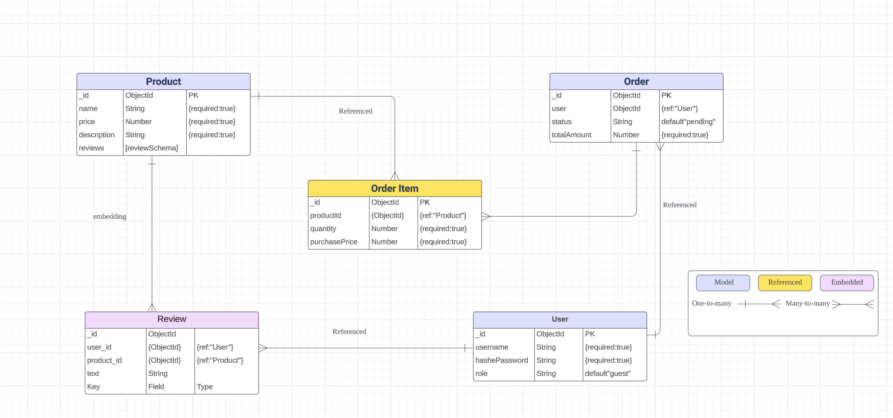

# Project Proposal 
## -  Fruit Basket
## Project Description 
Fruit Basket is an online fruit shop offering a wide selection of fresh, high-quality fruits delivered straight to your doorstep. From seasonal favorites to exotic varieties, we provide a convenient shopping experience for all fruit lovers. Whether you're stocking up for the week or gifting a loved one, our basket of fresh fruits is just a click away!

## User Stories
### MVP Goals
*  As a guest, I want to view a list of fruits with images, names, and prices, so that I can decide if I want to make a purchase.
*  As a guest, I want to view detailed product information and customer reviews, so that I can make an informed decision about purchasing the fruit.
*  As a guest, I want to create an account, so that I can place orders and leave reviews.
*  As a guest, I want to log into my account, so that I can access customer-specific features like adding products to the cart and placing orders.
*  As a customer, I want to add fruits to my shopping cart, so that I can prepare to place an order.
*  As a customer, I want to view the details of my order, so that I can confirm my purchase.
*  As a customer, I want to view my past orders, so that I can track my purchase history and leave reviews. 
*  As a customer, I want to leave a review and rating for a product I purchased, so that other customers can benefit from my feedback.
*  As a guest or customer, I want to view the reviews of a product, so that I can make an informed purchase decision.
*  As a customer, I want to securely log out of my account, so that my session ends.
*  As an admin, I want to add, edit, or delete products, so that I can keep the product list up to date.

  
### Stretch Goals
*    As a customer, I want to track my order status (Pending Payment, Awaiting Shipment, Awaiting Delivery, Delivered), so that I know the progress of my purchase.
*    As a customer, I want to proceed to a payment page after confirming my order, so that I can complete the purchase.
*    As a customer, I want to confirm when I have received the products, so that the order can be marked as "Delivered".
*    As a user, I want to track the status of my order in real-time, including delivery progress and estimated arrival time, so that I can stay informed about when my order will arrive.
*    As a user, I want personalized fruit recommendations based on my past purchases or preferences, so that I can easily discover new products that match my tastes.
*   As a user, I want to be able to add gift wrapping to my order for special occasions, so that I can send fresh fruits as a gift to someone.
  
## WireFrame

### Component Heirarchy Diagram: 

## ERD
An ERD (Entity-Relationship Diagram) will help you visualize the relationships between these models:

## Trello
Trello Management: We use [Trello](https://trello.com/b/22NnMFdj/fruit-basket) for our project work

## Define RESTful routes for managing data
Use the following charts as guides when building your RESTful routes.
### User Routes

| Action            | Route                  | HTTP Method|
| ------------------| -----------------------| ---------- |
| Create a user     | /users/signup          |    POST    |
| Log in a user     | /users/signin          |    POST    |
| Log out a user    | /users/signout         |    POST    |

### Products Routes

| Action                 | Route              | HTTP Method|
| ---------------------- | -------------------| ---------- |
|List all products       | /products          |    GET     |
|Get a product           | /products/productId|    GET     |
|Add a produce(admin)    | /products          |    POST    |
|Update a product(admin) | /products/productId|    PUT     |
|Delete a product(admin) | /products/productId|    DELETE  |

### Orders Routes

| Action                   | Route            | HTTP Method|
| -------------------------|------------------|------------|
|List all orders(Admin)    |/orders           |    GET     |
|Create a order            |/orders           |    POST    |
|Get details of a order    |/orders/orderId   |    GET     |
|Update order status(admin)|/orders/orderId   |    PUT     |

### Reviews Routes

| Action           | Route                            |HTTP Method |
| -----------------| ---------------------------------|------------|
|List all reviews  |/products/productId/reviews       |   GET      |
|Add a review      |/products/productId/reviews       |   POST     |
|Delete a review (Admin)|/products/productId/reviews/reviewId| DELETE  |

## Timeline - Daily Accountability
| Day       | Task                                        |
| --------- | ------------------------------------------- |
| 12/18     | Writing Proposal and Submit to github       |
| 12/19     | Set up back-end ,create models schema and Plan API routes  |
| 12/20     | Build server and middleware,implement user registration/login|
| 12/21-22  | Build product review  controllers           |
| 12/23-24  | Build order controllers and set up font-end |
| 12/25     | Build services API and test postman         |
| 12/26-27  | Build App,signup/signincomponent and navbar |
| 12/28-29  | Build productList/productDetail component   |
| 12/30-31  | Build reveiw component                      |
| 1/1-2     | Build order component                       |
| 1/3-5     | Test and Implement CSS                      |
| 1/6       | Testing and Depolyment (heroku,netlify)     | 
| 1/7       | Presentaiion                                |               

  

  
